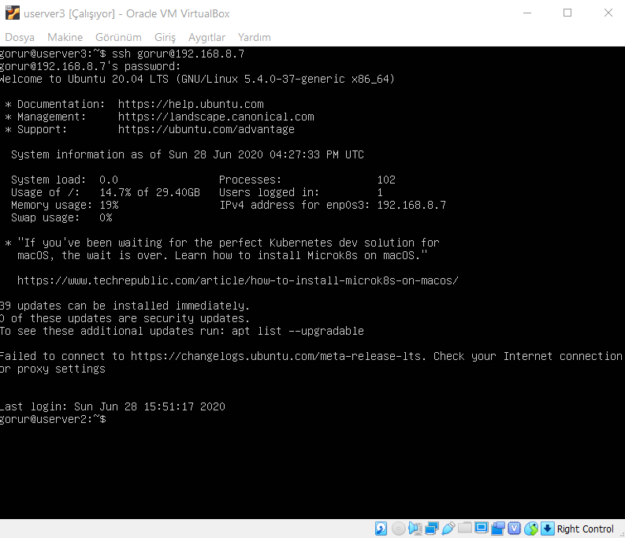
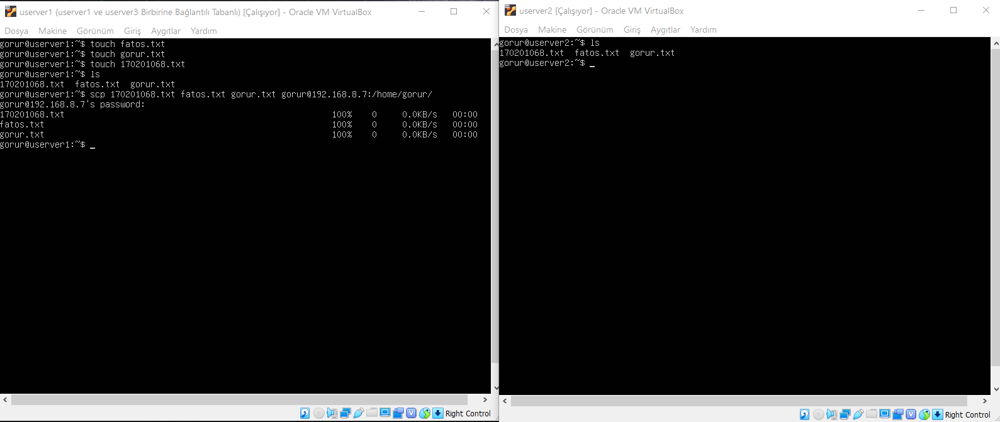
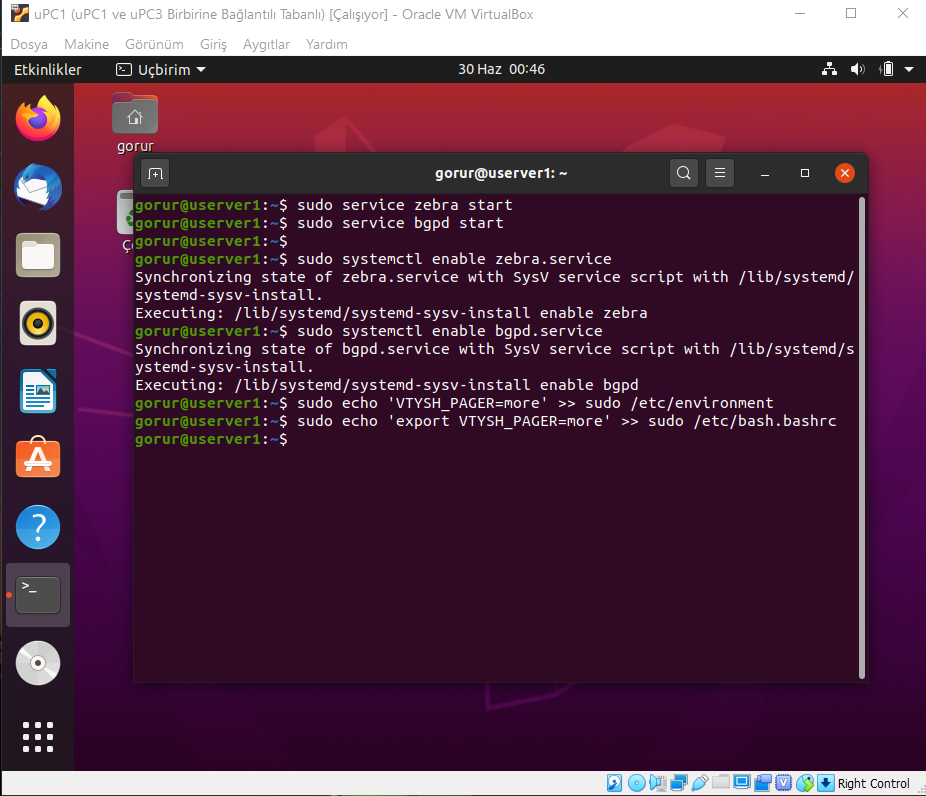

== LİNUX AĞ YÖNETİMİ 2020 FİNAL PROJESİ

== LİNUX NETWORKİNG

=====

Kişisel bilgisayarımda Virtualbox(6.0)üzerinde:

* Ubuntu Desktop 20 yükledim.uPC1 olarak isimlendirdim. Kullanıcı adı olarak soyadımı seçtim.
* TinyCore Linux (DCore Linux) yükledim. DC1 olarak isimlendirdim. Kullanıcı adı olarak ismimi seçtim.
* Ubuntu 20 Server yükledim.userver1 olarak isimlendirdim.Kullanıcı adı olarak soyadımı seçtim.

=====

==== Makinelerin Klonlanması
Kullanacağımız makineyi oluşturduktan sonra klon makine için sağ tıklayıp çoğalt seçeneği ile istediğimiz şekilde oluşturabiliriz.Daha az yer kaplamak ve ortak networklere beğlandığımız için MAC adresi ilkesini "Tüm ağ bağdaştırıcıları için yeni MAC adresleri oluştur" ve çoğaltma türünü "Birbirine bağlantılı çoğaltma" olarak seçtik.

* Ubuntu Desktop yükleyip uPC1 adını verdiğim sanal makinemi birbirine bağlantılı çoğaltma(klonlama) ile uPC2 adında yeni bir sanal makine klonladım.Aynı adımları uygulayarak uPC3 adını verdiğim başka bir sanal makine klonladım.
* 	TinyCore Linux (DCore Linux) yükleyip DC1 adını verdiğim sanal makinemi birbirine bağlantılı çoğaltma(klonlama) ile DC2 adında yeni bir sanal makine klonladım.Aynı adımları uygulayarak DC3 adını verdiğim başka bir sanal makine klonladım.
* 	Ubuntu 20 Server yükleyip userver1 adını verdiğim sanal makinemi birbirine bağlantılı çoğaltma(klonlama) ile userver2 adında yeni bir sanal makine klonladım.Aynı adımları uygulayarak userver2 adını verdiğim başka bir sanal makine klonladım.

Klonlanmış Makineler:

=== SENARYO 1

1.1.NAT ile Host-Guest Ubuntu PC Bağlantısı

	uPC1 olarak isimlendirdiğim guest makinemin ağ bağdaştırıcısını NAT olarak seçtim.
	
SSH

    Host makineye NAT bağlantı ile erişebilmek için gerekli port yönlendirmesini yaptım.Anamakine b.noktasını 14601,misafir b.noktasını 22 olarak ayarladım.

   Gueste ssh ile bağlanabilmek için: 
   $ sudo apt install shh ile shh yüklüyoruz.
   

  Gerekli isim düzenlemeleri yapıldıktan sonra ssh yüklemeyi tekrar göstermek istedim.SSH yüklü olduğu için "ssh zaten en yeni sürümde" bilgisi verilmiştir.
  

  
   uPC1 sanal makinesi terminalinden $ ip –c a yazarak ip adresimi 10.0.2.15 olarak buldum. 
   Port yönlendirmesi yaptıktan sonra host(kullandığım) bilgisayardan:
   ssh localhost –p 14601 –l gorur yazarak ssh bağlantısı yapılıp yapılmadığını kontrol ettim ve ssh bağlantısı yapılabildiğini gösterdim.

PİNG

   
 Host(kullandığım) bilgisayardan:
ping ip adresi (10.0.2.15) ssh ile bağlandığım sanal makineye ping yapıp yapamadığımı kontrol ettim,ping yapamadığımı gösterdim.

MİSAFİR EKLENTİLERİ

  
   Misafir eklentilerini guest makineye sanal disk takarak yükleyebiliyoruz bu sayede hosttan gueste veya guestten hosta kopyala yapıştır ve sürükle bırak yapabiliyoruz.
   Host bilgisayardan dosya kopyala-yapıştır yapabilmek için misafir eklentileri CD kalıbını yerleştiri seçerek Vboxguestaddition yükledim.Paylaşılan pano ve sürüklü,bırak çift yönlü seçtim.
   
   
 
 
image::images/senaryo1/dosyabırak.gif[]

   Host bilgisayarımda gorur.txt adında bir metin belgesi oluşturdum.Bu belgeyi sürükle bırak ile uPC1 sanal makinemin Dosyalar kısmına bıraktım.
   
   

1.2.Köprü Bağdaştırıcı ile Host-Guest TinyCore Bağlantısı

  DC1 olarak isimlendirdiğim guest makinemin ağ bağdaştırıcı ayarlarını Köprü Bağdaştırıcısı olarak ayarladım.
 
  

  DC1 sanal makinesinin ip adresini bulmak için terminal ekranına $ ifconfig komutunu yazdım.İp adresini 192.168.1.41 olarak buldum.

SSH

  SSH bağlantısı yapabilmek için DC1 terminal ekranında:
  $ cd /usr/local/etc/ssh/
  $ sudo cp ssh_config.orig sshd_config
  $ sudo /usr/local/etc/init.d/openssh start yazarak gerekli yüklemeleri yaptım.
   

 Host bilgisayarın terminal ekranında:
ssh fatos@192.168.1.42 yazarak SSH bağlantısı yapılabildiğini gösterdim.

PİNG

 Host bilgisayarın terminal ekranında:
ssh fatos@192.168.1.42 yazarak SSH bağlantısı yapılabildiğini gösterdim.

1.3.Yalnızca Anamakine Bağdaştırıcı ile Host-Guest Ubuntu Server Bağlantısı

  
  Yalnızca-anamakine bağdaştırıcı kullanabilmek için öncelikle host network oluşturmak gereklidir.Ana menüden Dosya->Anamakine Ağ Yöneticisi seçip oluştura tıklıyoruz ve network oluşuyor.

  userver1 olarak isimlendirdiğim guest makinemin ağ bağdaştırıcı ayarlarını yalnızca-anamakine bağdaştırıcısı seçip alt seçenekten oluşturduğum host network'ü seçtim.
  

 userver1 terminal ekranında:
hostname –I yazarak IP adresimi buldum.(192.168.31.3)

SSH

Ubuntu Server kurulumu sırasında SSH bağlantısı için gerekli yüklemeleri otomatik olarak yaptığımdan ayrıca bir yükleme yapmama gerek kalmadı.

 Host bilgisayarın terminal ekranında:
ssh gorur@192.168.31.3 yazarak SSH bağlantısı yapılabildiğini gösterdim.

PİNG

 Host(kullandığım) bilgisayardan:
ping ip adresi (192.168.31.3) komutu ile  SSHla bağlandığım sanal makineye ping yapıp yapamadığımı kontrol ettim,ping yapabildiğimi gösterdim.

=== SENARYO 2

Dahili Ağ Bağdaştırıcı ile Host-Guest,Guest-Guest Bağlantısı

Senaryo gereği Ubuntu Serverların ipleri:

userver1 : 192.168.8.6

userver2 : 192.168.8.7

userver3 : 192.168.8.8

image::images/senaryo2/userverdahili.png[]

 userver1, userver2 ve userver3 guest makinelerim için ağ bağdaştırıcı ayarlarını dahili ağ olarak seçtim.

Netplan Ayarları

yaml formatındaki /etc/netplan/50-cloud-init.yaml dosyasını dhcp olmadan statik bir IP alıyoruz.

 userver1,userver2 ve userver3 terminalinde:
 $ sudo nano /etc/netplan/50-cloud-init.yaml komutu ile dosyayı açtım.
 
 

 userver1 IP adresini statik olarak verilen koşul gereği 192.168.8.6 olarak ayarladım.

 $ sudo netplan generate komutundan sonra $ sudo netplan apply ile statik IP atamamı uyguladım ve artık IP adresimin 192.168.8.6 olduğunu gördüm.
 

 userver2 IP adresini statik olarak verilen koşul gereği 192.168.8.7 olarak ayarladım.

image::images/senaryo2/userver2ip.png[]

 $ sudo netplan generate komutundan sonra $ sudo netplan apply ile statik IP atamamı uyguladım ve artık IP adresimin 192.168.8.7 olduğunu gördüm.
 

 userver3 IP adresini statik olarak verilen koşul gereği 192.168.8.8 olarak ayarladım. 

 $ sudo netplan generate komutundan sonra $ sudo netplan apply ile statik IP atamamı uyguladım ve artık IP adresimin 192.168.8.8 olduğunu gördüm.
 
SSH

SSH server yüklediğimiz için ve diğer makineler klon olduğu için ayrıca yükleme yapmaya gerek yoktur.
Guestler arası SSH bağlantısı yapılabilmektedir.

 
 userver1 sanal makinesinde ssh gorur@192.168.8.8 komutu userver3 ile SSH bağlantısı yaptım.
 

 userver1 sanal makinesinde ssh gorur@192.168.8.7 komutu userver2 ile SSH bağlantısı yaptım.
 

 userver3 sanal makinesinde ssh gorur@192.168.8.7 komutu userver2 ile SSH bağlantısı yaptım.
 
 

Dahili ağ bağdaştırıcıda hosttan guestlere SSH bağlantısı yapmak mümkün değildir.

 Host bilgisayardan userver1,userver2 ve userver3 sanal makinelerine SSH yapamadığımı sırasıyla gösterdim.

PİNG

Guestler birbirine ulaşabildiği için birbirine ping yapabilmeleri mümkündür.

image::images/senaryo2/ping3.png[]

SCP ile Dosya Gönderimi

 userver1 bilgisayarında $ touch komutu ile dosya ismi fatos.txt, gorur.txt ve 170201068.txt şeklinde olan dosyalar oluşturdum ve dosyaların varlığını kontrol etmek için $ ls komutunu kullandım.
 

 $ scp 170201068.txt fatos.tct gorur.txt gorur@192.168.8.7:/home/gorur/ ile oluşturduğum dosyaları SCP protokolünü kullanarak userver2 bilgisayarına gönderdim.
 
 
 userver2 bilgisayarına dosya gönderim işlemi gerçekleşmiş mi diye kontrol etmek için $ ls komutunu kullandım ve gönderimin başarılı bir şekilde gerçekleştiğini gördüm.
 
 
 
=== SENARYO 3

=====

IP:

uPC1: NAT(10.0.2.15)
      dahili1(192.168.1.1)
      
uPC2: NAT(10.0.2.15)
      dahili2(192.168.2.1)
      
userver1: NAT(10.0.2.15)
          dahili1(192.168.1.254)
          dahili3(192.168.100.1)
          
userver2: NAT(10.0.2.15)
          dahili1(192.168.2.254)
          dahili3(192.168.100.2)

=====

  userver1 olarak isimlendirdiği Ubuntu Server sanal makinesine,Ubuntu desktopla NAT bağlantı ile erişebilmek için gerekli port yönlendirmesini yaptım.Anamakine b.noktasını 8888,misafir b.noktasını 22 olarak ayarladım.

  
  ssh localhost -p 8888 -l gorur komutu ile Ubuntu Desktop ile Ubuntu Server sanal makineme bağlandım.(Amacım daha kolay kopyala-yapıştır işlemlerini yapabilmek.)
  

QUAGGA KULLANARAK LİNUX YÖNLENDİRİCİ AĞI

QUAGGA YÜKLEME 

[source,]
----
#!/bin/bash
# quagga installer

if [ "$EUID" -ne 0 ]
  then echo "Please run as root"
  exit
fi

sudo apt install quagga quagga-doc
sudo cat > /etc/quagga/daemons << EOF
zebra=yes
bgpd=no
ospfd=yes
ospf6d=no
ripd=no
ripngd=no
isisd=no
babeld=no
EOF

sudo echo "net.ipv4.ip_forward=1" >> /etc/sysctl.conf

sudo cp /usr/share/doc/quagga-core/examples/vtysh.conf.sample /etc/quagga/vtysh.conf
sudo cp /usr/share/doc/quagga-core/examples/zebra.conf.sample /etc/quagga/zebra.conf
sudo cp /usr/share/doc/quagga-core/examples/bgpd.conf.sample /etc/quagga/bgpd.conf
sudo chown quagga:quagga /etc/quagga/*.conf
sudo chown quagga:quaggavty /etc/quagga/vtysh.conf
sudo chmod 640 /etc/quagga/*.conf

sudo service zebra start
sudo service bgpd start

sudo systemctl enable zebra.service
sudo systemctl enable bgpd.service

sudo echo 'VTYSH_PAGER=more' >>/etc/environment 
sudo echo 'export VTYSH_PAGER=more' >>/etc/bash.bashrc
----

 Quagga paketini kurdum.

  etc/quagga/daemons dosyasını düzenledim.

  Zebra ve ospfd için yapılandırma dosyaları oluşturdum.

  Vtysh END probleminden kaçınmak için ortam değişkenlerini ayarladım.

  $sudo vtysh komutu ile Quagga'yı başlattım.
  
  

ROUTER YAPILANDIRMA

Oluşturulacak routerlar için yapılandırma ayarları:
[source,]
----
#!/bin/bash

if [ "$EUID" -ne 0 ]
  then echo "Please run as root"
  exit
fi

cat >> /etc/quagga/ospfd.conf << EOF
interface enp0s8
interface enp0s9
interface lo
router ospf
 passive-interface enp0s8
 network 192.168.1.0/24 area 0.0.0.0
 network 192.168.100.0/24 area 0.0.0.0
line vty
EOF

cat >> /etc/quagga/zebra.conf << EOF
interface enp0s8
 ip address 192.168.1.254/24
 ipv6 nd suppress-ra
interface enp0s9
 ip address 192.168.100.1/24
 ipv6 nd suppress-ra
interface lo
ip forwarding
line vty
EOF

sudo service zebra restart
sudo service bgpd restart
----

 Klonlanacak routerlar için gerekli config ayarlamalarını yapmış oldum.
 

 Ubuntu Serverdan birbirine bağlantılı çoğaltma ile router1 ve router2 adında iki yönlendirici klonladım.
 
 

 Senaryo gereği bağdaştırıcı 1'i NAT olarak ayarladım.

  
  Senaryo gereği bağdaştırıcı 2'yi Dahili Ağ yapıp dahili1 olarak isimlendirdim.
  

 
  Senaryo gereği bağdaştırıcı 3'ü Dahili Ağ yapıp dahili3 olarak isimlendirdim.

 Senaryo gereği bağdaştırıcı 1'i NAT olarak ayarladım.

  
  Senaryo gereği bağdaştırıcı 2'yi Dahili Ağ yapıp dahili2 olarak isimlendirdim.
  

 
  Senaryo gereği bağdaştırıcı 3'ü Dahili Ağ yapıp dahili3 olarak isimlendirdim.
  
router2 için yapılandırma ayarları: 
[source,]
----
#!/bin/bash

if [ "$EUID" -ne 0 ]
  then echo "Please run as root"
  exit
fi

cat >> /etc/quagga/ospfd.conf << EOF
interface enp0s8
interface enp0s9
interface lo
router ospf
 passive-interface enp0s8
 network 192.168.2.0/24 area 0.0.0.0
 network 192.168.100.0/24 area 0.0.0.0
line vty
EOF

cat >> /etc/quagga/zebra.conf << EOF
interface enp0s8
 ip address 192.168.2.254/24
 ipv6 nd suppress-ra
interface enp0s9
 ip address 192.168.100.2/24
 ipv6 nd suppress-ra
interface lo
ip forwarding
line vty
EOF

sudo service zebra restart
sudo service bgpd restart
----
 

  /etc/quagga/ospfd.conf dosyasının içini router2'ye göre düzenleyip kaydettim.
  

  /etc/quagga/zebra.conf dosyasının içini router2'ye göre düzenleyip kaydettim.
  

 Yapılan ayarlamaları yeniden başlattım.
 

 Yaptığım düzenlemeler sonrası router1 ip'sini kontrol ettim.
 
image::images/senaryo3/router2ip.png[]

 Yaptığım düzenlemler sonrası router2 ip'sini kontrol ettim.
 
Netplan Ayarları

image::images/senaryo3/upc2nat.png[]

yaml formatındaki /etc/netplan/50-cloud-init.yaml dosyasını dhcp olmadan statik bir IP alıyoruz.

 uPC1 sanal makinesinde:
 $ sudo nano /etc/netplan/50-cloud-init.yaml komutu ile dosyayı açtım.
 
 

 uPC1 IP adresini statik olarak belirlediğim koşula göre ayarladım.

 $ sudo netplan generate komutundan sonra $ sudo netplan apply ile statik IP atamamı uyguladım.

 uPC2 sanal makinesinde:
 $ sudo nano /etc/netplan/50-cloud-init.yaml komutu ile dosyayı açtım.
 
 

 uPC2 IP adresini statik olarak belirlediğim koşula göre ayarladım.

 $ sudo netplan generate komutundan sonra $ sudo netplan apply ile statik IP atamamı uyguladım.
 

TRACEROUTE

Traceroute komutu ile paketlerin izlediği yolun takibini yapabiliriz.

 $ sudo apt-get install traceroute ile traceroute yükledim.
 
 

 uPC1 ----> router1

 uPC1 ----> router2
 

 uPC1 ----> uPC2

=====
NETWORK AĞ GRAFİĞİ

=====
